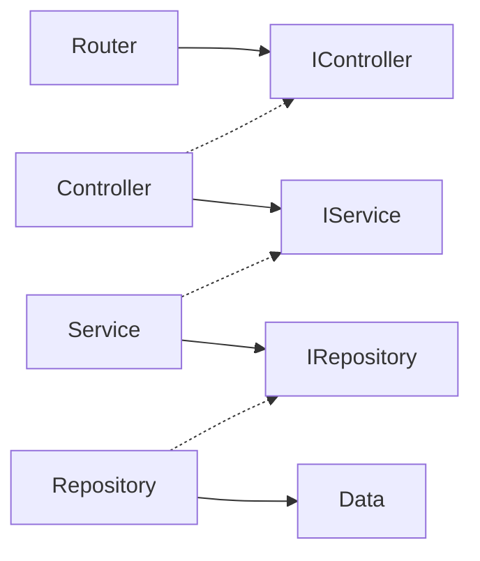

# Gin入門 Go言語ではじめるサーバーサイド開発

## このリポジトリについて

以下のような3層アーキテクチャを採用しています



## 使い方

### DB接続環境の設定

```bash
cp .env.sample .env
```

### 秘密鍵の設定

```bash
echo SECRET_KEY=`openssl rand -hex 32` >> .env
```

### パッケージのインストール

```bash
go mod tidy
```

### docker compose でDBを起動

```bash
docker compose up -d 
```

### マイグレーション

```bash
go run cmd/migrate/main.go
```

### APIの動作確認

https://insomnia.rest/download

を使って確認する。各リクエストのサンプルは`./sample/Insomnia.json`に保存しています

### テスト

```bash
go test ./...
```
