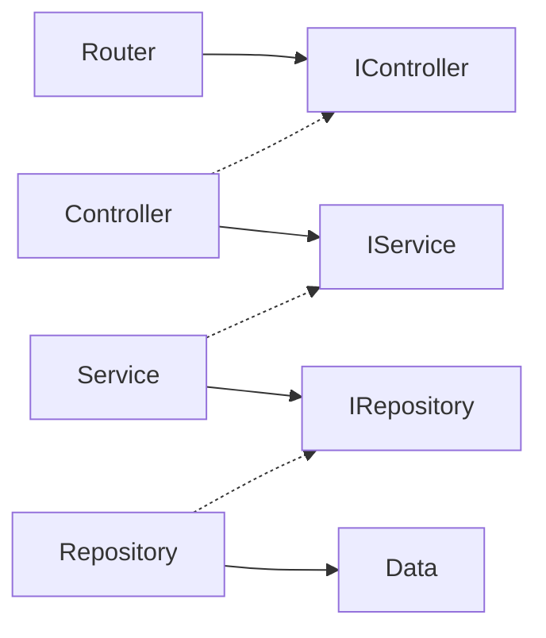

# Gin入門 Go言語ではじめるサーバーサイド開発

## このリポジトリについて

以下のような3層アーキテクチャを採用しています

```mermaid
graph LR
    Router --> IController
    Controller -.-> IController
    Controller --> IService
    Service -.-> IService
    Service --> IRepository
    Repository -.-> IRepository
    Repository --> Data
```
